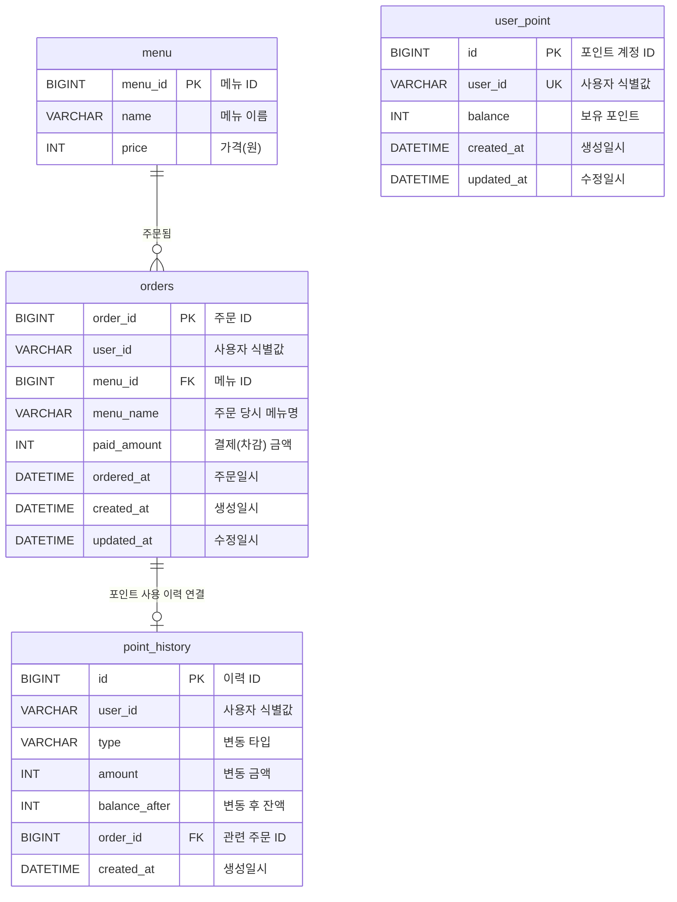

# ERD

`docs/api/*.md` 명세를 기준으로 커피숍 주문 시스템에서 사용하는 테이블과 관계를 정리합니다.

## 설계 전제

- 이 과제의 필수 API 4개(메뉴 조회/포인트 충전/주문·결제/인기 메뉴 조회)에는 회원가입·로그인 API가 없다.
  → 별도 `users` 테이블을 두지 않고, `userId`는 클라이언트가 보내는 문자열 식별값 그대로 사용한다.
- `point-charge-api.md` 설계 메모("사전 등록 없이 최초 충전 시 자동 생성")를 따라, `user_point`는 최초 충전 시점에 자동 생성된다.
- `orders`는 "메뉴 1개 = 주문 1건"만 다룬다(장바구니/복수 메뉴 주문은 요구사항에 없음). 주문 시점의 메뉴명·가격을 스냅샷으로 저장해 이후 메뉴 정보가 바뀌어도 과거 주문 내역이 변하지 않도록 한다.
- 포인트 차감·주문 생성의 동시성 전략(락 종류)은 스키마 변경이 아닌 트랜잭션/쿼리 레벨 결정이므로 ERD에는 컬럼을 추가하지 않고, 각 API 문서의 설계 메모에서 다룬다.

## 관계도

> `user_point` ↔ `point_history` / `orders`는 실제 FK 제약이 아니라 `user_id`(문자열) 기준의 논리적 연결이다. 별도 `users` 테이블이 없으므로 mermaid 다이어그램에는 표시하지 않았다.

## 테이블 정의

### menu

커피 메뉴 목록 조회(`menu-list-api.md`), 인기 메뉴 조회(`popular-menu-api.md`), 주문(`order-payment-api.md`)의 기준 테이블입니다.

| 논리명 | 컬럼명 | 타입 | NULL | 제약/비고 |
| --- | --- | --- | --- | --- |
| 메뉴 ID | menu_id | BIGINT | NOT NULL | PK, AUTO_INCREMENT |
| 메뉴 이름 | name | VARCHAR(50) | NOT NULL | |
| 가격 | price | INT | NOT NULL | 원화 정수, 0 이상 |

### user_point

사용자별 보유 포인트 잔액의 기준 테이블입니다. 별도 회원가입 없이, 최초 충전(`point-charge-api.md`) 요청 시 자동 생성됩니다.

| 논리명 | 컬럼명 | 타입 | NULL | 제약/비고 |
| --- | --- | --- | --- | --- |
| 포인트 계정 ID | id | BIGINT | NOT NULL | PK |
| 사용자 식별값 | user_id | VARCHAR(50) | NOT NULL | UNIQUE |
| 보유 포인트 | balance | INT | NOT NULL | 0 이상, 기본값 0 |
| 생성일시 | created_at | DATETIME | NOT NULL | 최초 충전 시각 |
| 수정일시 | updated_at | DATETIME | NULL | 마지막 변동 시각 |

- 충전 시 `balance`를 원자적으로 갱신한다 (`UPDATE user_point SET balance = balance + :amount WHERE user_id = :userId`). 동시 충전 요청 시 race condition을 막기 위한 전략은 `docs/api/point-charge-api.md` 설계 메모에서 다룬다.

### point_history

포인트 변동(충전/사용) 이력을 append-only로 저장하여, 언제든 `user_point.balance`와 이력 합계를 대조할 수 있도록 합니다.

| 논리명 | 컬럼명 | 타입 | NULL | 제약/비고 |
| --- | --- | --- | --- | --- |
| 이력 ID | id | BIGINT | NOT NULL | PK |
| 사용자 식별값 | user_id | VARCHAR(50) | NOT NULL | user_point.user_id 값 (실제 FK 제약 없음) |
| 변동 타입 | type | VARCHAR(20) | NOT NULL | CHARGE(충전), USE(주문 결제 사용) |
| 변동 금액 | amount | INT | NOT NULL | 항상 양수, `type`으로 증감 방향 구분 |
| 변동 후 잔액 | balance_after | INT | NOT NULL | 변동 처리 직후 `balance` 스냅샷 |
| 관련 주문 ID | order_id | BIGINT | NULL | `type = USE`일 때 `orders.order_id`, 충전(`CHARGE`)이면 NULL |
| 생성일시 | created_at | DATETIME | NOT NULL | |

### orders

주문 생성과 결제를 함께 기록하는 기준 테이블입니다(`order-payment-api.md`). 주문 1건은 메뉴 1개에 대응합니다.

| 논리명 | 컬럼명 | 타입 | NULL | 제약/비고 |
| --- | --- | --- | --- | --- |
| 주문 ID | order_id | BIGINT | NOT NULL | PK |
| 사용자 식별값 | user_id | VARCHAR(50) | NOT NULL | |
| 메뉴 ID | menu_id | BIGINT | NOT NULL | FK: menu.menu_id |
| 주문 당시 메뉴명 | menu_name | VARCHAR(50) | NOT NULL | 메뉴명 스냅샷 (이후 메뉴명 변경과 무관) |
| 결제(차감) 금액 | paid_amount | INT | NOT NULL | 주문 당시 메뉴 가격 스냅샷 |
| 주문일시 | ordered_at | DATETIME | NOT NULL | |
| 생성일시 | created_at | DATETIME | NOT NULL | |
| 수정일시 | updated_at | DATETIME | NULL | |

- "포인트 차감"과 "주문 생성"은 하나의 트랜잭션으로 처리한다(둘 중 하나만 성공하는 상황 방지). 락 전략(비관적 락/분산 락)은 `docs/api/order-payment-api.md` 설계 메모에서 다룬다.
- 인기 메뉴 조회(`popular-menu-api.md`)는 별도 집계 테이블 없이 `orders`를 `ordered_at` 최근 7일 조건 + `menu_id` 기준 `GROUP BY`로 직접 집계한다 (요구사항이 "정확성"을 명시하므로 실시간 직접 집계를 우선한다).

## 관계 요약

| 관계 | 설명 |
| --- | --- |
| menu - orders | 메뉴 하나는 여러 주문에서 참조될 수 있다. |
| orders - point_history | 주문 결제 시 포인트 사용(USE) 이력 1건이 해당 주문과 연결된다(주문당 0~1건). |
| user_point - point_history | (문자열 `user_id` 기준 논리적 연결) 포인트 계정 하나는 여러 변동 이력을 가진다. |
